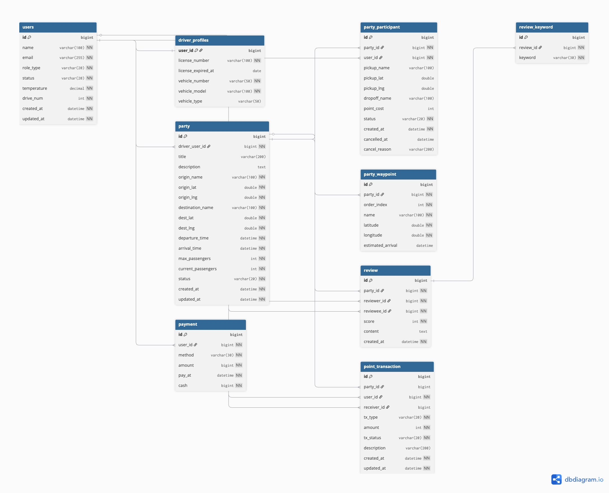

# [클라우드 1팀] 현대오토에버 모빌리티 SW 스쿨 3기

## About

현대오토에버 모빌리티 SW 스쿨 3기 Cloud 과정에서 진행한 최종 프로젝트입니다.

본 프로젝트는 MSA 기반 카풀 예약 서비스 **WanderPool**의 서비스 코드, 배포 매니페스트, gRPC 계약, 문서 자료를 정리하고 공유하기 위한 공간입니다.

본 Organization은 GitLab에서 진행한 [wanderpool](https://gitlab.com/wanderpool) 프로젝트를 GitHub로 이관한 아카이브입니다.

## Project

### WanderPool

> 출퇴근길 카풀 파티 생성, 참여, 예약을 지원하는 MSA 기반 카풀 예약 서비스입니다.

WanderPool은 인증, 회원, 파티, 지도 서비스를 분리해 구성했으며, 서비스 간 통신과 배포 자동화를 고려해 개발했습니다.

## Team

<table>
  <tr>
    <td align="center">
      <a href="https://github.com/Wooniq">
         
        <b>한지운</b>
      </a>
       
      PL, BE
    </td>
    <td align="center">
      <a href="https://github.com/taehyun02">
         
        <b>김태현</b>
      </a>
       
      BE
    </td>
    <td align="center">
      <a href="https://github.com/sunwoo-0111">
         
        <b>임선우</b>
      </a>
       
      BE
    </td>
    <td align="center">
      <a href="https://github.com/MODIFYC">
         
        <b>최수정</b>
      </a>
       
      FE
    </td>
  </tr>
</table>

## Period

| 항목 | 내용 |
|---|---|
| 개발 기간 | 2026.04.14 ~ 2026.06.29 |
| 개발 인원 | 4명 |
| 과정 | 현대오토에버 모빌리티 SW 스쿨 3기 Cloud |

## Awards

| 수상 | 내용 |
|---|---|
| 우수 프로젝트상 | **프로젝트:** 현대오토에버 Cloud 프로젝트 **팀:** WanderPool **교육과정:** 현대오토에버 클라우드 스쿨 3기 **주관:** 주식회사 현대오토에버 · 주식회사 현대엔지비 · 특수법인 한국전파진흥협회 |

## Tech Stack

| Category | Stack |
|---|---|
| Frontend | Next.js, Vercel |
| Backend | Java 21, Spring Boot 3.2+, gRPC |
| Infra / Network | Kubernetes, AWS S2S VPN, Kong, Istio |
| Data / Storage | MySQL, PostgreSQL, Redis, AWS S3 |
| CI/CD | Jenkins, GitLab CI, Docker, Harbor, Argo CD |
| Observability | Prometheus, Grafana, Elasticsearch, Fluentd, Kibana, Kiali |
| Collaboration | Jira, Slack, GitLab |

## Repositories

| Repository | Description |
|---|---|
| `wanderpool-auth` | 인증·인가 서비스 |
| `wanderpool-member` | 회원 정보 및 사용자 도메인 관리 서비스 |
| `wanderpool-party` | 카풀 파티·예약·참여 관리 서비스 |
| `wanderpool-map` | 지도·경로·위치 관리 서비스 |
| `wanderpool-common` | 공통 모듈 및 재사용 컴포넌트 |
| `wanderpool-proto` | 서비스 간 gRPC Protobuf 계약 |
| `wanderpool-fe` | 프론트엔드 애플리케이션 |
| `wanderpool-gitops` | Kubernetes·ArgoCD 배포 매니페스트 |
| `wanderpool-docs` | 아키텍처·API 문서·트러블슈팅 자료 |

## Main Features

- OAuth 기반 사용자 인증
- 회원 정보 관리
- 카풀 파티 생성 및 참여
- 지도 기반 위치 및 경로 정보 제공
- 서비스 간 gRPC 통신
- Kubernetes 기반 서비스 배포
- Jenkins, Argo CD 기반 CI/CD
- Prometheus, Grafana, Elasticsearch, Fluentd, Kibana, Kiali 기반 관측 환경 구성

## Screens

| 화면 | 설명 |
|---|---|
| 메인 화면 | 추후 업데이트 예정 |
| 로그인 화면 | 추후 업데이트 예정 |
| 카풀 파티 목록 | 추후 업데이트 예정 |
| 카풀 파티 상세 | 추후 업데이트 예정 |
| 지도 화면 | 추후 업데이트 예정 |
| 마이페이지 화면 | 추후 업데이트 예정 |

## Architecture

## Database ERD

## Notice

- 본 Organization은 교육 과정 산출물 보관 및 팀원 공동 관리를 목적으로 합니다.
- 민감정보는 저장소에 커밋하지 않습니다.
- `.env`, `application-prod.yml`, Secret manifest는 업로드하지 않습니다.
- 외부 공개 전 토큰, 계정 정보, 사설 IP 포함 여부를 확인합니다.
